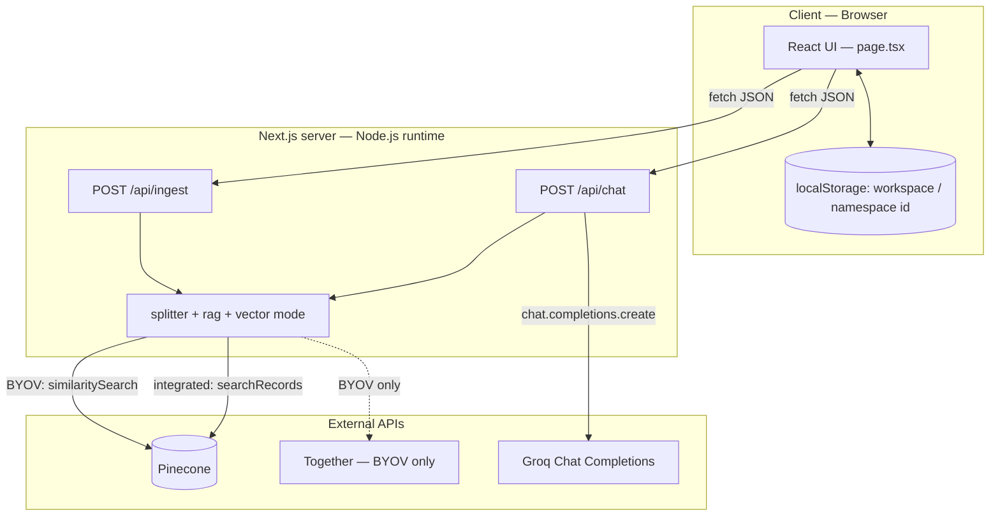
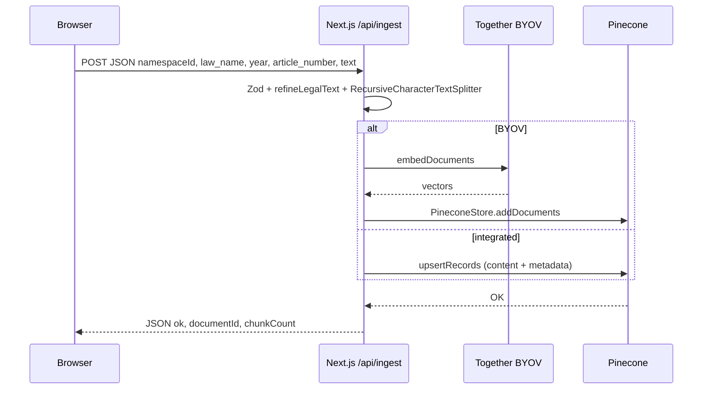
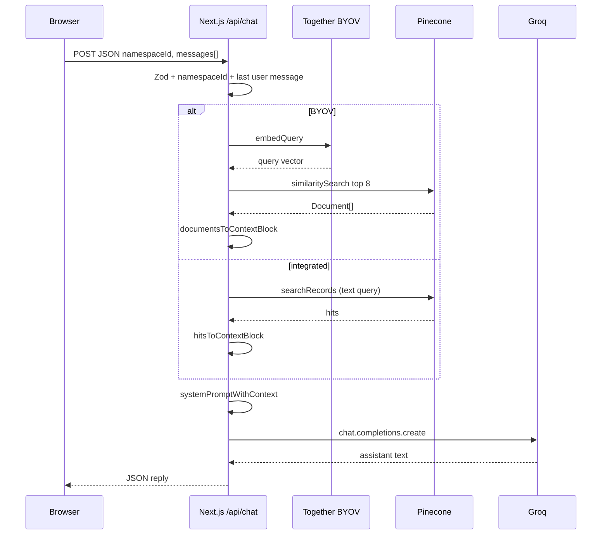

# System architecture, flow, endpoints, and engine

This document is the **technical map** of Mashreq: how components connect, how requests move through the system, which **HTTP endpoints** exist, and what the **RAG engine** does step by step.

---

## 1. System architecture (layers)

Mashreq is a **single Next.js application**. The browser talks only to your Next server; the server talks to **Pinecone** (retrieval) and **Groq** (generation). Retrieval is configured with **`MASHREQ_VECTOR_MODE`**: **integrated** (Pinecone embeds) or **byov** (Together + LangChain `PineconeStore`).

| Layer | Responsibility |
| ----- | ---------------- |
| __Client__ | RTL Arabic UI, chat history state, ingest form, persists `namespaceId` in `localStorage` (workspace isolation id). |
| __Next.js API routes__ | Validate input (Zod), orchestrate LangChain + Groq, return JSON. |
| __`src/lib/langchain/*`__ | **BYOV:** Together embeddings, `PineconeStore` factory. **Both:** `RecursiveCharacterTextSplitter` (legal separators). |
| __`src/lib/rag.ts`__ | `hitsToContextBlock` (integrated), `documentsToContextBlock` (BYOV), Arabic system prompt. |
| __`src/lib/vectorMode.ts`__ | `MASHREQ_VECTOR_MODE` → integrated vs BYOV. |
| __`src/lib/refineLegalText.ts`__ | Cleans PDF noise before chunking. |
| __`src/lib/namespace.ts`__ | Validates `namespaceId` format. |
| __Together AI__ | **BYOV only:** embeddings (`TOGETHER_AI_API_KEY`). |
| __Pinecone__ | **Integrated:** `upsertRecords` / `searchRecords` with `content` + metadata. **BYOV:** dense vectors + metadata per namespace. |
| __Groq__ | Chat LLM (`GROQ_MODEL`); __non-streaming__ today. |

Both API routes declare **`runtime = "nodejs"`** so the Pinecone and Groq SDKs run on Node, not the Edge runtime.

---

## 2. The engine: retrieval-augmented generation (RAG)

The **engine** lives in `src/app/api/chat/route.ts`, `src/lib/rag.ts`, and `src/lib/vectorMode.ts`:

1. **Retrieve** — **Integrated:** `searchRecords` with the last user message as text (`RAG_TOP_K` = 8). **BYOV:** `PineconeStore.similaritySearch` after **TogetherAIEmbeddings** embeds the query.
2. __Augment__ — **Integrated:** `hitsToContextBlock`. **BYOV:** `documentsToContextBlock` (`pageContent` + `law_name`, `article_number`, `year`, optional `category`).
3. __Generate__ — Groq chat completion; `temperature: 0.2`, `max_tokens: 2048`.

**Ingest:** `refineLegalText` → **`RecursiveCharacterTextSplitter`** (chunk 1000, overlap 200, legal separators) → **integrated:** `upsertRecords` in batches; **BYOV:** Together embeddings → **`PineconeStore.addDocuments`**. Bulk: `laws:ingest`, `laws:ingest-pdf` follow the same mode.

---

## 3. End-to-end flows

### 3.1 Ingest flow (indexing legal text)

**BYOV** (`MASHREQ_VECTOR_MODE=byov`): browser → Next.js splits text → Together embeds chunks → Pinecone `addDocuments`.

**Integrated** (`MASHREQ_VECTOR_MODE=integrated`): browser → Next.js splits text → Pinecone `upsertRecords` (server embeds from `content`).

### 3.2 Chat flow (question → answer)

---

## 4. HTTP endpoints

Only **POST** JSON endpoints are implemented; there is no public GET API for documents.

| Method | Path | Purpose |
| ------ | ---- | ------- |
| `POST` | `/api/ingest` | Split + refine; **integrated:** `upsertRecords`; **BYOV:** Together + `addDocuments`. |
| `POST` | `/api/chat` | **Integrated:** `searchRecords`; **BYOV:** similarity search; then Groq. |

### 4.1 `POST /api/ingest`

**Body (JSON)**

| Field | Role |
| ----- | ---- |
| `namespaceId` | Pinecone namespace (workspace); must pass server validation. |
| `law_name` | Stored on every chunk; used in citations in context. |
| `year` | Stored per chunk. |
| `article_number` | Article or section label; stored per chunk. |
| `text` | Full paste of legal text (50–500,000 chars). |
| `category` | Optional tag (e.g. workers’ rights). |

**Success:** `{ "ok": true, "documentId": "<uuid>", "chunkCount": <n> }`  
**Errors:** `400` validation / no chunks; `500` server or Pinecone failure.

### 4.2 `POST /api/chat`

**Body (JSON)**

| Field | Role |
| ----- | ---- |
| `namespaceId` | Same workspace as ingest; search is scoped here. |
| `messages` | 1–30 items: `{ "role": "user" \| "assistant", "content": string }` (max 8000 chars per message). |

**Behavior detail:** Retrieval uses only the **last** message with `role === "user"` as the search query. In **BYOV** mode, quality depends on Together’s embedding model; in **integrated** mode, on Pinecone’s configured embedding model.

__Success:__ `{ "reply": "<assistant text>" }`  
__Errors:__ `400` bad body / missing user message; `500` missing `GROQ_API_KEY` or upstream errors.

---

## 5. Data model in Pinecone

### BYOV (LangChain `PineconeStore`)

Chunk text is stored under the **`text`** field (`textKey` in `mashreqVectorStore.ts`) plus flat metadata:

| Key | Use |
| --- | --- |
| Vector id | `{batchUuid}:{chunkIndex}` when passed explicitly; otherwise generated. |
| `text` (or configured `textKey`) | Chunk body → `Document.pageContent` on read. |
| `law_name`, `year`, `article_number` | Citations in `documentsToContextBlock`. |
| `category` | Optional (UI or `MASHREQ_DEFAULT_LAW_CATEGORY`). |
| `source_pdf`, `loc`, … | From `PDFLoader` when using `laws:ingest-pdf`. |

### Integrated (`upsertRecords` / `searchRecords`)

Records use a **`content`** text field (mapped to the index `text` dimension per Pinecone `field_map`, e.g. `text=content`) plus the same citation metadata: `law_name`, `year`, `article_number`, optional `category`. `_id` is generated per chunk.

Namespaces partition data in both modes: same index name, different `namespaceId` → different record/vector sets.

---

## 6. Related documentation

- [API](./api.md) — same endpoints with slightly more validation detail
- [Overview](./overview.md) — product-oriented architecture summary
- [Services](./services.md) — what Groq and Pinecone are conceptually
- [Configuration](./configuration.md) — env vars and index creation command
