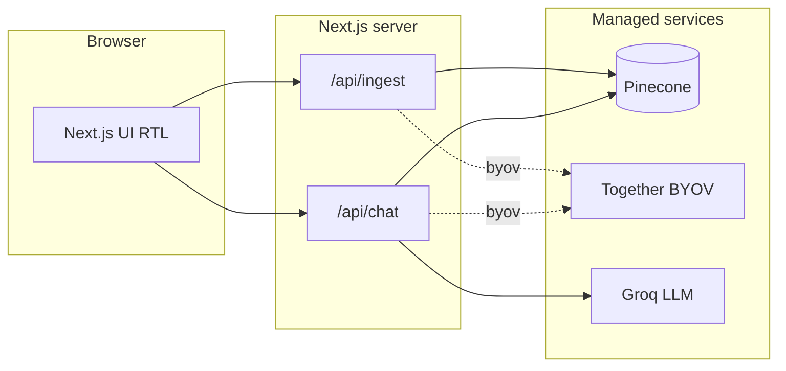

# Overview

## What Mashreq is

Mashreq is an AI-powered **educational** assistant for exploring **indexed legal text**. The current implementation focuses on:

- **Semantic search** over text you upload (colloquial or formal Arabic supported in prompts; quality depends on the embedding model and corpus).
- **Grounding**: the LLM is instructed to answer only from retrieved chunks. If nothing relevant is indexed, it should say so.
- **Citation-shaped metadata**: each chunk is stored with `law_name`, `article_number`, and `year` so answers can reference them when present in context.
- **Multi-tenant isolation** via Pinecone **namespaces** (one opaque ID per “workspace” in the browser).

It uses **LangChain** for splitting (and **BYOV** path: `PDFLoader`, `PineconeStore`, **Together** embeddings). **`MASHREQ_VECTOR_MODE`** selects **integrated** Pinecone inference vs **BYOV**. **Groq** generates answers. **Next.js** API routes replace a separate Express service. Namespaces isolate tenants, similar in spirit to [namespace-notes](https://docs.pinecone.io/examples/sample-apps/namespace-notes).

## Target audience (product intent)

- Citizens researching rights and procedures.
- Entrepreneurs navigating corporate, tax, and investment rules.
- Legal professionals using it as a quick search aid over **your own** uploaded materials.

**Operators vs users:** Setting up Pinecone, `.env`, and bulk PDF scripts is done by whoever **runs or hosts** the app (see [Configuration — Who has to do the Pinecone / pipeline steps?](./configuration.md#who-has-to-do-the-pinecone--pipeline-steps)). People who only **visit** the deployed site use the UI; they are not expected to create indexes or run `npm run laws:pipeline`.

## Architecture (lean stack)

| Layer | Technology |
| ----- | ---------- |
| UI | Next.js 15 (App Router), React 19, RTL Arabic layout, `Noto Sans Arabic` |
| Retrieval | **BYOV:** LangChain `PineconeStore` + Together + similarity search. **Integrated:** `searchRecords` / `upsertRecords`. |
| Generation | Groq Chat Completions (`groq-sdk`) |
| Validation | Zod on API bodies |

New to these tools? Read **[Services explained](./services.md)** for what Groq, Pinecone, and Next.js each do in Mashreq.

For **endpoints, sequence diagrams, and the RAG engine step-by-step**, see **[Architecture & engine](./architecture.md)**.

## Data flow (simplified)

1. **Ingest**: Text is refined (`refineLegalText`), split with LangChain **`RecursiveCharacterTextSplitter`**, then **BYOV:** Together + **`PineconeStore.addDocuments`**; **integrated:** **`upsertRecords`** with `content` + metadata.
2. **Chat**: Latest user message drives retrieval — **BYOV:** Together embed + `similaritySearch` + `documentsToContextBlock`; **integrated:** `searchRecords` + `hitsToContextBlock`. Groq answers in Arabic under strict grounding rules.
3. **Namespace**: The UI stores a workspace ID in `localStorage` and sends it with each request. Pinecone isolates vectors per namespace.

## Legal disclaimer

> Mashreq is an AI assistant for educational purposes only and is not a substitute for professional legal advice from a licensed attorney.

The same idea appears in Arabic in the web UI. Operators must keep official sources authoritative and not present the tool as legal advice.

## Privacy (MVP)

The server does not implement user accounts. Questions are processed per request; **namespace IDs** are generated client-side and are not inherently personal data. Do not paste sensitive personal information into prompts or ingest forms if your deployment policy forbids it.

## LLM note (Groq vs Gemini)

The product brief may mention Gemini; **Gemini is not hosted on Groq**. This repo uses **Groq-hosted models** (e.g. Llama) via `GROQ_MODEL`. You can swap providers later if you add another SDK and route.
